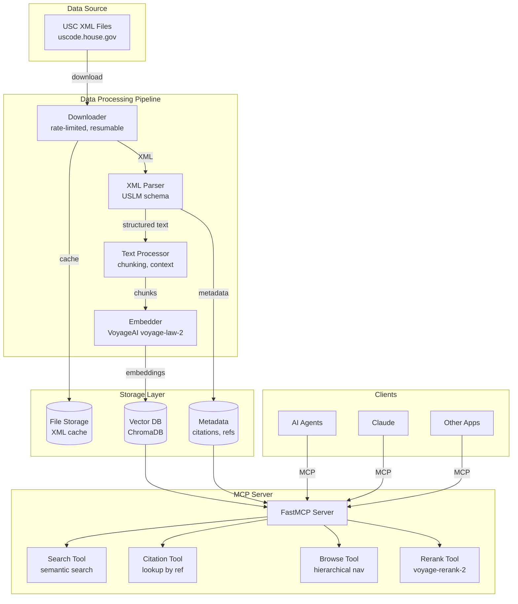

# USC Semantic Search MCP Server - Architecture

## System Overview

The USC Semantic Search MCP Server provides AI agents with intelligent access to the United States Code through semantic search capabilities.

## Component Architecture



## Data Flow

### 1. Ingestion Pipeline
```
XML Download → Parse → Extract Text → Chunk → Embed → Store
```

### 2. Search Flow
```
Query → Embed Query → Vector Search → Rerank → Return Results
```

### 3. MCP Communication
```
Agent → MCP Request → Tool Execution → Format Response → Agent
```

## Key Design Decisions

### Chunking Strategy
- **Level**: Section-based chunks
- **Size**: ~1000 tokens per chunk
- **Overlap**: 100 tokens
- **Context**: Include title, chapter, section hierarchy

### Embedding Strategy
- **Model**: voyage-law-2 (optimized for legal text)
- **Batch Size**: 25 documents
- **Dimensions**: 1024
- **Input Type**: "document" for content, "query" for searches

### Search Strategy
1. **Semantic Search**: Top-k similar chunks
2. **Reranking**: voyage-rerank-2 for precision
3. **Context Expansion**: Include surrounding sections
4. **Citation Format**: Standard legal citations

## MCP Tools

### 1. Search Tool
```python
@mcp.tool
def search_usc(query: str, limit: int = 10, title: Optional[int] = None) -> List[SearchResult]:
    """Semantic search across US Code"""
```

### 2. Citation Tool
```python
@mcp.tool
def get_citation(citation: str) -> CitationResult:
    """Retrieve specific USC section by citation"""
```

### 3. Browse Tool
```python
@mcp.tool
def browse_usc(title: Optional[int] = None, chapter: Optional[int] = None) -> BrowseResult:
    """Browse USC hierarchy"""
```

### 4. Context Tool
```python
@mcp.tool
def get_context(section_id: str, context_size: int = 2) -> ContextResult:
    """Get surrounding sections for context"""
```

## Database Schema

### ChromaDB Collections

#### 1. usc_sections
- **id**: Unique identifier (e.g., "26-1-1001")
- **embedding**: Vector representation
- **metadata**:
  - title_num: int
  - title_name: str
  - chapter_num: int
  - chapter_name: str
  - section_num: str
  - section_name: str
  - full_citation: str
  - effective_date: str
  - last_amended: str

#### 2. usc_metadata
- Cross-references
- Amendment history
- Notes and annotations

## Performance Targets

- **Search Latency**: <100ms
- **Embedding Rate**: 1000 sections/minute
- **Storage Efficiency**: ~10GB for full USC
- **Concurrent Requests**: 50 agents

## Security Considerations

- API key management via environment variables
- Rate limiting per agent
- Input validation and sanitization
- Secure storage of embeddings

## Monitoring

- API usage tracking
- Search query analytics
- Performance metrics
- Error logging

## Future Enhancements

1. **Multi-version Support**: Track USC changes over time
2. **Cross-reference Graph**: Navigate related sections
3. **Regulatory Integration**: Link to CFR
4. **Case Law Links**: Connect to relevant cases
5. **Natural Language Generation**: Summarize complex sections